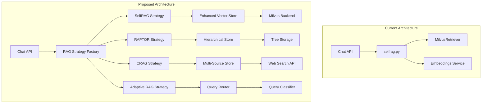

# Multi-RAG Architecture Implementation Plan

## Overview
Adding RAPTOR, CRAG, and Adaptive RAG to your existing SelfRAG chatbot system requires significant architectural changes to support multiple RAG strategies with a clean, extensible design.

## Current Architecture Analysis

### Extension Points Identified:
1. **Direct Integration**: [`chat.py:68`](backend/app/api/routes/chat.py:68) calls [`selfrag_run()`](backend/app/services/selfrag.py:38) directly - needs abstraction
2. **Simple Vector Store**: [`MilvusRetriever`](backend/app/services/vectorstores/milvus_store.py:6) only supports flat retrieval - needs hierarchical capabilities  
3. **Basic Config**: [`RagConfig`](backend/app/schemas/tenant.py:14) schema is SelfRAG-specific - needs extension
4. **No Strategy Selection**: No query classification or routing logic exists
5. **Missing Infrastructure**: No confidence scoring, web search, or tree storage capabilities

## Proposed Architecture



## Implementation Plan

### Phase 1: Core Infrastructure (2-3 weeks)

#### 1.1 Abstract RAG Strategy Interface
**File**: `backend/app/services/rag/base.py`

```python
from abc import ABC, abstractmethod
from typing import Dict, List, Tuple, Any, Optional
from dataclasses import dataclass

@dataclass
class RAGResult:
    response: str
    metadata: Dict[str, Any]
    confidence_score: Optional[float] = None
    retrieval_sources: Optional[List[str]] = None
    strategy_used: Optional[str] = None

class BaseRAGStrategy(ABC):
    """Abstract base class for all RAG strategies"""
    
    def __init__(self, config: Dict[str, Any]):
        self.config = config
        
    @abstractmethod
    async def execute(
        self, 
        query: str, 
        api_key: str, 
        chat_model: str, 
        system_prompt: str
    ) -> RAGResult:
        """Execute the RAG strategy and return results"""
        pass
    
    @abstractmethod
    def validate_config(self) -> bool:
        """Validate strategy-specific configuration"""
        pass
    
    @abstractmethod
    def get_required_dependencies(self) -> List[str]:
        """Return list of required Python packages"""
        pass
```

#### 1.2 Enhanced Vector Store Interface
**File**: `backend/app/services/vectorstores/enhanced_store.py`

```python
from abc import ABC, abstractmethod
from typing import List, Dict, Any, Optional, Tuple
from enum import Enum

class RetrievalLevel(Enum):
    LEAF = "leaf"           # Original chunks
    INTERMEDIATE = "intermediate"  # Clustered summaries
    ROOT = "root"          # High-level abstractions

class EnhancedVectorStore(ABC):
    """Enhanced interface supporting hierarchical and multi-modal retrieval"""
    
    @abstractmethod
    async def search_flat(self, query_embedding: List[float], top_k: int) -> List[Tuple[str, float]]:
        """Traditional flat vector search"""
        pass
    
    @abstractmethod
    async def search_hierarchical(
        self, 
        query_embedding: List[float], 
        levels: List[RetrievalLevel], 
        top_k_per_level: int
    ) -> Dict[RetrievalLevel, List[Tuple[str, float]]]:
        """Multi-level hierarchical search for RAPTOR"""
        pass
    
    @abstractmethod
    async def search_with_metadata_filter(
        self, 
        query_embedding: List[float], 
        metadata_filters: Dict[str, Any], 
        top_k: int
    ) -> List[Tuple[str, float, Dict[str, Any]]]:
        """Search with metadata filtering"""
        pass
```

#### 1.3 RAG Strategy Factory
**File**: `backend/app/services/rag/factory.py`

```python
from typing import Dict, Type
from .base import BaseRAGStrategy
from .selfrag_strategy import SelfRAGStrategy
from .raptor_strategy import RAPTORStrategy
from .crag_strategy import CRAGStrategy
from .adaptive_strategy import AdaptiveRAGStrategy

class RAGStrategyFactory:
    """Factory for creating RAG strategy instances"""
    
    _strategies: Dict[str, Type[BaseRAGStrategy]] = {
        "selfrag": SelfRAGStrategy,
        "raptor": RAPTORStrategy,
        "crag": CRAGStrategy,
        "adaptive": AdaptiveRAGStrategy,
    }
    
    @classmethod
    def create_strategy(cls, strategy_type: str, config: Dict) -> BaseRAGStrategy:
        if strategy_type not in cls._strategies:
            raise ValueError(f"Unknown RAG strategy: {strategy_type}")
        
        strategy_class = cls._strategies[strategy_type]
        return strategy_class(config)
    
    @classmethod
    def get_available_strategies(cls) -> List[str]:
        return list(cls._strategies.keys())
```

### Phase 2: Individual RAG Strategies (4-6 weeks)

#### 2.1 RAPTOR Strategy Implementation
**Requirements:**
- **Tree Storage**: Extended Milvus collections with level metadata
- **Clustering**: scikit-learn for document clustering
- **Summarization**: LLM calls for abstractive summaries
- **Multi-level Retrieval**: Query embedding against different tree levels

**File**: `backend/app/services/rag/raptor_strategy.py`

```python
class RAPTORStrategy(BaseRAGStrategy):
    """
    RAPTOR builds retrieval tree by recursively clustering documents
    and creating abstractive summaries at each level
    """
    
    def __init__(self, config: Dict[str, Any]):
        super().__init__(config)
        self.max_tree_depth = config.get("max_tree_depth", 3)
        self.cluster_threshold = config.get("cluster_threshold", 0.5)
        self.summary_model = config.get("summary_model", "gpt-3.5-turbo")
        
    async def execute(self, query: str, api_key: str, chat_model: str, system_prompt: str) -> RAGResult:
        # 1. Query tree at multiple levels (leaf, intermediate, root)
        # 2. Collect relevant chunks from different abstraction levels  
        # 3. Rank and select best information
        # 4. Generate response using multi-level context
        pass
    
    async def build_retrieval_tree(self, documents: List[str]) -> Dict[int, List[str]]:
        """Build hierarchical tree structure through clustering and summarization"""
        pass
```

**New Dependencies:**
```
scikit-learn>=1.3.0
umap-learn>=0.5.0
networkx>=3.1
```

#### 2.2 CRAG Strategy Implementation  
**Requirements:**
- **Confidence Scoring**: LLM-based relevance evaluation
- **Web Search Integration**: Tavily, Google Custom Search, or Bing APIs
- **Knowledge Filtering**: Remove contradictory/outdated information

**File**: `backend/app/services/rag/crag_strategy.py`

```python
class CRAGStrategy(BaseRAGStrategy):
    """
    CRAG evaluates retrieval quality and corrects with web search
    when internal knowledge is insufficient
    """
    
    def __init__(self, config: Dict[str, Any]):
        super().__init__(config)
        self.confidence_threshold = config.get("confidence_threshold", 0.7)
        self.web_search_provider = config.get("web_search_provider", "tavily")
        self.max_web_results = config.get("max_web_results", 5)
        
    async def execute(self, query: str, api_key: str, chat_model: str, system_prompt: str) -> RAGResult:
        # 1. Initial retrieval from vector store
        # 2. Confidence scoring of retrieved content
        # 3. If confidence < threshold: trigger web search
        # 4. Knowledge refinement and filtering
        # 5. Generate response with corrected knowledge
        pass
    
    async def evaluate_confidence(self, query: str, retrieved_docs: List[str]) -> float:
        """Score confidence of retrieved documents for the query"""
        pass
    
    async def web_search_fallback(self, query: str) -> List[str]:
        """Perform web search when internal knowledge is insufficient"""
        pass
```

**New Dependencies:**
```
tavily-python>=0.3.0
# OR google-search-results>=2.4.0
# OR python-bing-search>=1.0.0
requests>=2.31.0
```

#### 2.3 Adaptive RAG Strategy
**Requirements:**
- **Query Classification**: ML model or LLM-based classification
- **Strategy Selection**: Rule-based or learned routing decisions
- **Performance Monitoring**: Track success metrics per strategy

**File**: `backend/app/services/rag/adaptive_strategy.py`

```python
class AdaptiveRAGStrategy(BaseRAGStrategy):
    """
    Adaptive RAG routes queries to optimal strategy based on
    query classification and complexity analysis
    """
    
    def __init__(self, config: Dict[str, Any]):
        super().__init__(config)
        self.routing_rules = config.get("routing_rules", {})
        self.fallback_strategies = config.get("fallback_strategies", ["selfrag"])
        self.performance_weights = config.get("performance_weights", {})
        
    async def execute(self, query: str, api_key: str, chat_model: str, system_prompt: str) -> RAGResult:
        # 1. Classify query type (factual, analytical, creative, etc.)
        # 2. Determine optimal RAG strategy for query type
        # 3. Route to selected strategy
        # 4. Monitor performance and adjust routing logic
        pass
    
    async def classify_query(self, query: str) -> str:
        """Classify query to determine optimal RAG strategy"""
        pass
    
    async def select_strategy(self, query_type: str) -> str:
        """Select best RAG strategy based on query classification"""
        pass
```

### Phase 3: Configuration Schema Extensions (1 week)

#### 3.1 Enhanced Tenant Schema
**File**: `backend/app/schemas/tenant.py`

```python
from typing import Optional, List, Literal, Dict, Union
from pydantic import BaseModel

class RAPTORConfig(BaseModel):
    max_tree_depth: int = 3
    cluster_threshold: float = 0.5
    summary_model: str = "gpt-3.5-turbo"
    clustering_algorithm: Literal["kmeans", "hierarchical"] = "kmeans"

class CRAGConfig(BaseModel):
    confidence_threshold: float = 0.7
    web_search_provider: Literal["tavily", "google", "bing"] = "tavily"
    max_web_results: int = 5
    web_search_api_key: Optional[str] = None
    knowledge_conflict_resolution: Literal["web_priority", "internal_priority", "hybrid"] = "hybrid"

class AdaptiveRAGConfig(BaseModel):
    routing_rules: Dict[str, str] = {}
    fallback_strategies: List[str] = ["selfrag"]
    performance_weights: Dict[str, float] = {}
    query_classifier_model: str = "gpt-3.5-turbo"

class EnhancedRagConfig(BaseModel):
    enabled: bool = False
    strategy: Literal["selfrag", "raptor", "crag", "adaptive"] = "selfrag"
    provider: Literal["milvus"] = "milvus"
    milvus: Optional[RagMilvusConfig] = None
    embedding_provider: Literal["sentence_transformers", "openai", "voyageai"] = "sentence_transformers"
    embedding_model: str = "sentence-transformers/all-MiniLM-L6-v2"
    provider_keys: Dict[str, str] = {}
    top_k: int = 3
    
    # Strategy-specific configs
    raptor_config: Optional[RAPTORConfig] = None
    crag_config: Optional[CRAGConfig] = None
    adaptive_config: Optional[AdaptiveRAGConfig] = None
```

### Phase 4: API Integration (1-2 weeks)

#### 4.1 Updated Chat Route
**File**: `backend/app/api/routes/chat.py` (modifications)

```python
# Replace direct selfrag_run call with factory pattern
from app.services.rag.factory import RAGStrategyFactory

# In the generate() function:
if request_wants_rag and rag_conf.get("provider") == "milvus":
    try:
        strategy_type = rag_conf.get("strategy", "selfrag")
        strategy = RAGStrategyFactory.create_strategy(strategy_type, rag_conf)
        
        result = await strategy.execute(
            query=request_data.message,
            api_key=tenant_config["openrouter_api_key"],
            chat_model=tenant_config["model"],
            system_prompt=tenant_config.get("system_prompt") or ""
        )
        
        full_response = result.response
        # Include metadata in response for debugging/monitoring
        metadata = result.metadata
        
        if full_response:
            chunk_obj = {"choices": [{"delta": {"content": full_response}}]}
            yield f"data: {json.dumps(chunk_obj)}\n\n"
        yield "data: [DONE]\n\n"
```

#### 4.2 Enhanced RAG Management Endpoints
**File**: `backend/app/api/routes/rag.py` (additions)

```python
@router.get("/rag/strategies")
async def list_rag_strategies():
    """List available RAG strategies and their configurations"""
    return {
        "strategies": RAGStrategyFactory.get_available_strategies(),
        "descriptions": {
            "selfrag": "Self-reflective RAG with retrieval decision making",
            "raptor": "Hierarchical tree-based retrieval with multi-level summaries",
            "crag": "Corrective RAG with web search fallback and confidence scoring",
            "adaptive": "Adaptive strategy selection based on query classification"
        }
    }

@router.post("/rag/build-tree")
async def build_raptor_tree(
    payload: RaptorTreeBuildRequest, 
    x_tenant_id: str = Header(None)
):
    """Build RAPTOR retrieval tree for tenant's documents"""
    # Implementation for building hierarchical tree structure
    pass
```

### Phase 5: Infrastructure Dependencies (1-2 weeks)

#### 5.1 Additional Python Dependencies
**File**: `backend/requirements.txt` (additions)

```
# RAPTOR dependencies
scikit-learn>=1.3.0
umap-learn>=0.5.0
networkx>=3.1
scipy>=1.11.0

# CRAG dependencies  
tavily-python>=0.3.0
requests>=2.31.0
beautifulsoup4>=4.12.0

# Adaptive RAG dependencies
transformers>=4.34.0
torch>=2.0.0

# Enhanced monitoring
prometheus-client>=0.17.0
```

#### 5.2 Enhanced Vector Store Implementation
**File**: `backend/app/services/vectorstores/hierarchical_milvus.py`

```python
from .enhanced_store import EnhancedVectorStore, RetrievalLevel

class HierarchicalMilvusStore(EnhancedVectorStore):
    """Milvus implementation supporting hierarchical retrieval for RAPTOR"""
    
    def __init__(self, config: Dict[str, Any]):
        self.config = config
        self.collections = {}  # level -> collection mapping
        
    async def search_hierarchical(
        self, 
        query_embedding: List[float], 
        levels: List[RetrievalLevel], 
        top_k_per_level: int
    ) -> Dict[RetrievalLevel, List[Tuple[str, float]]]:
        """Multi-level search across tree structure"""
        results = {}
        for level in levels:
            collection = self.collections[level]
            level_results = await self._search_collection(
                collection, query_embedding, top_k_per_level
            )
            results[level] = level_results
        return results
```

## Migration Strategy

### Backward Compatibility
1. **Default Strategy**: Existing tenants continue using SelfRAG by default
2. **Configuration Migration**: Automatic migration of existing [`RagConfig`](backend/app/schemas/tenant.py:14) to [`EnhancedRagConfig`](backend/app/schemas/tenant.py:14)
3. **API Compatibility**: Existing API endpoints remain functional
4. **Gradual Rollout**: New strategies enabled on opt-in basis

### Data Migration
1. **Vector Store**: No immediate migration required for existing embeddings
2. **Tree Building**: RAPTOR trees built on-demand for tenants that enable it
3. **Configuration**: Tenant configs automatically extended with new fields

## Performance Monitoring

### Metrics to Track
1. **Strategy Performance**: Response time and quality per RAG type
2. **Confidence Scores**: Distribution of confidence scores for CRAG
3. **Web Search Usage**: Frequency and success rate of external searches
4. **Query Classification**: Accuracy of adaptive routing decisions
5. **Resource Usage**: Compute and storage costs per strategy

### Monitoring Implementation
```python
# backend/app/services/rag/monitoring.py
from prometheus_client import Counter, Histogram, Gauge

# Strategy usage metrics
strategy_usage_counter = Counter('rag_strategy_usage_total', 'RAG strategy usage', ['strategy', 'tenant'])
strategy_latency_histogram = Histogram('rag_strategy_duration_seconds', 'RAG strategy execution time', ['strategy'])
confidence_score_gauge = Gauge('rag_confidence_score', 'RAG confidence score', ['strategy', 'tenant'])
```

## Estimated Timeline

| Phase | Duration | Effort |
|-------|----------|---------|
| Core Infrastructure | 2-3 weeks | High |
| RAPTOR Implementation | 2-3 weeks | High |
| CRAG Implementation | 2-3 weeks | Medium |
| Adaptive RAG Implementation | 1-2 weeks | Medium |
| Configuration Extensions | 1 week | Low |
| API Integration | 1-2 weeks | Medium |
| Infrastructure Setup | 1-2 weeks | Medium |
| **Total** | **10-16 weeks** | |

## Risk Assessment

### High Risk
- **Complexity**: RAPTOR tree building and storage complexity
- **Performance**: Multi-strategy overhead on response times
- **External Dependencies**: Web search API rate limits and costs

### Medium Risk  
- **Configuration Management**: Complex config schema validation
- **Data Migration**: Potential issues with existing tenant data
- **Resource Usage**: Increased memory and compute requirements

### Low Risk
- **API Compatibility**: Well-isolated changes to existing endpoints
- **Monitoring**: Straightforward metrics collection

## Conclusion

Adding RAPTOR, CRAG, and Adaptive RAG requires substantial architectural changes but the modular design ensures:

1. **Extensibility**: Easy addition of future RAG strategies
2. **Maintainability**: Clean separation of concerns
3. **Performance**: Strategy-specific optimizations
4. **Backward Compatibility**: Zero disruption to existing deployments

The phased approach allows for iterative development and testing, ensuring system stability throughout the implementation process.